# Web Client App part 1
##### Enda Lee 2022
#### Quick Start
in terminal: 
1. ```npm install```
2. ```npm run start```


## Introduction

This tutorial will show how to display data, from **your** ```Supabase``` database, in a web page. You will use a combination of ```JavaScript```, ```HTML```, and ```CSS```. 

The Supabase API examples for accessing data can be found in the API section for JavaScript - these will be referenced later.

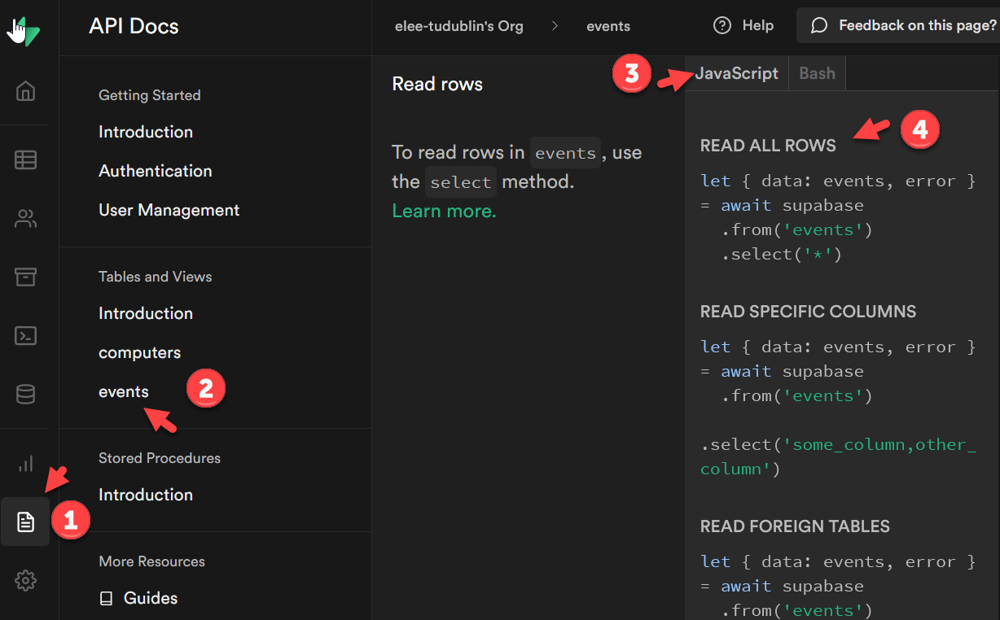


## Pre-requisites

This tutorial continues from the previous ones, make sure that you:

1. Have setup a ```Supabase``` account and created the example database (**[PART 1](https://github.com/elee-tudublin/year2-project-2022/blob/main/1.Database_Setup_Supabase.md)**)
2. Can insert to the database using an ```MQTT script``` and the ```Supabase API``` (**[PART 2](https://github.com/elee-tudublin/year2-project-2022/blob/main/2.Using_The_Supabase_API.md)**)

### Install Node.js

The client website needs to be hosted as web browsers enforce a ```same origin policy``` which can block access to data from external sources when a web page is not hosted opened directly.

Make sure that you have an up-to-date version of Node.js installed on your system. To check the current version (if installed), **open a console/ terminal** and then run **```node --version```**. You will see an error if Node.js is not currently installed.

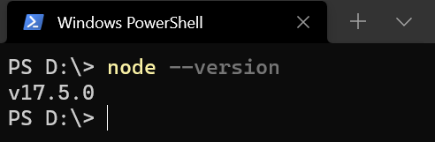

To install or update Node.JS, download the current version from the **[nodejs.org website](https://nodejs.org/en/)**.

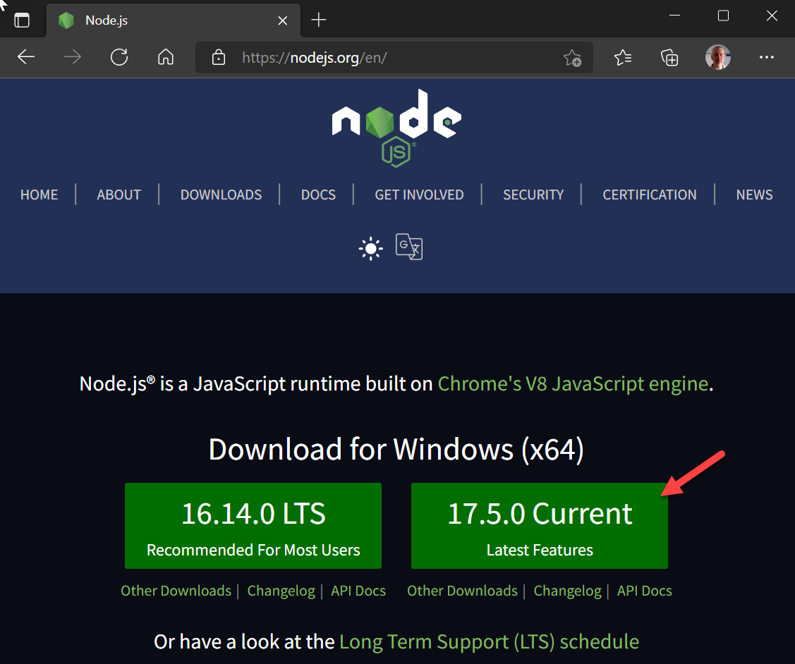


### Install VS Code

You should also make sure the latest version of **[VS Code](https://code.visualstudio.com/)** is installed before continuing this tutorial.


## The start application

#### 1. Download

To get started, download the code from this repository.  It contains a website which is hosted by ```Node.js + Express```. 

After downloading, unzip the start application and *move it to somewhere easy to find, e.g., ```c:/webapps/y2-project/```.

#### 2. Open with VS Code

It is important to **open the web app folder in VS Code** and not individual files from a project. Folders can be opened from the VS Code file menu or by right-clicking the folder in windows explorer and choosing **Open with VS Code**).

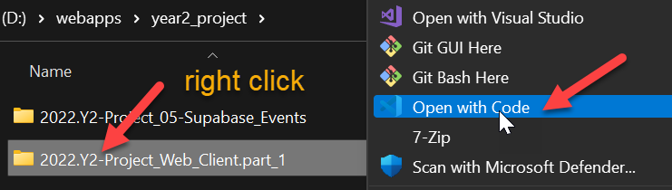


The website can be found in the ```public``` folder, the contents of which will be hosted by the web server. You will find the home page for the site, ```index.html``` here.

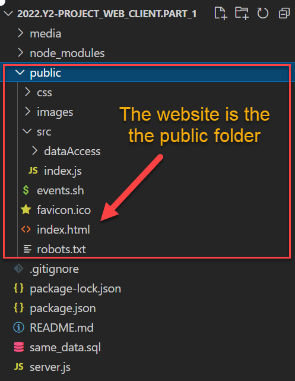

Most of the files outside of the ```public``` folder are used by ```Node.js and Express``` to configure and start the HTTP server, ```server.js``` being the most important. You will not need to modify any of these files but it is important not to delete them!

This file is ```readme.md``` and the screenshots are stored in the ```media``` folder.

#### 3. Start the the Node HTTP server

To start the webserver, first open a ```New Terminal``` from the Terminal menu in VS Code.

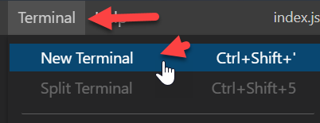


Then use the Node Package Manager to install the required dependencies using the ```npm install``` command.

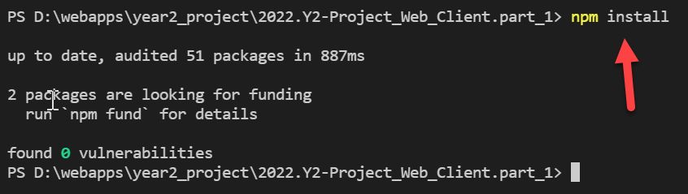

Finally, start the server using the ```npm run start``` command.

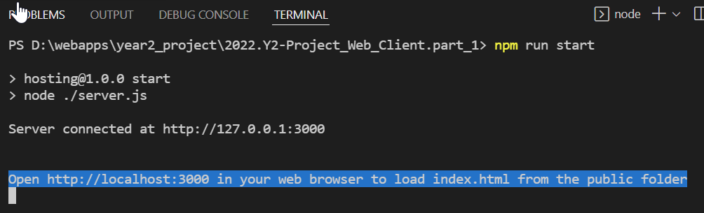

If everything worked, the message above will be returned in the terminal to indicate that the server is listening on ```http://localhost:3000```.

#### 4. Open the web app

Open ```http://localhost:3000``` in a web browser. This should load the site home page ```index.html``` from the public folder in the application. That in turn will load the JavaScript and CSS  required to display the page.

You should also open the browser console and check for any error messages or other information useful for diagnosing problems.

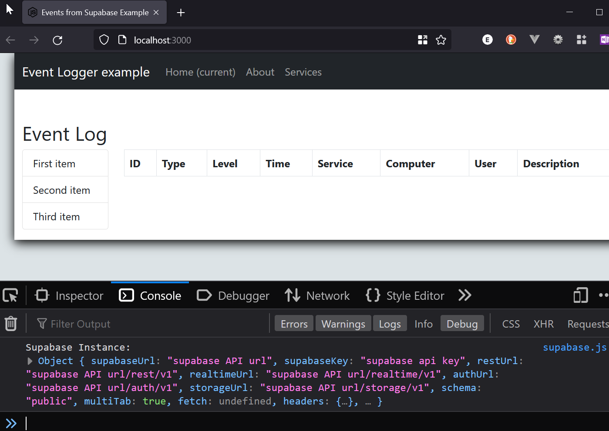


## Connecting to Supabase

The next step is to connect to Supabase so that data can be retrieved via the API. The application has been partially configured but you will need to add some parameters and settings for your Supabase account.

The full Supabase reference guide for JavaScript is linked from the site, see  [https://supabase.com/docs/reference/javascript/supabase-client](https://supabase.com/docs/reference/javascript/supabase-client)

#### 1. Load Supabase dependencies

This is a set of JavaScript functions which provides access to the database. The script is loaded near the end of ```index.html``` see:

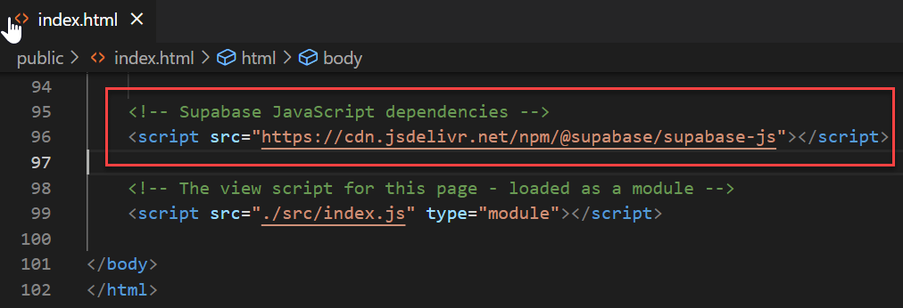

Also note that ```index.js``` after Supabase, more on that later.


#### 2. Configure Supabase

Now to configure Supabase so that it can access your account and database. Open ```supbase.js``` which you can find the the ```public/src/dataAccess``` folder.

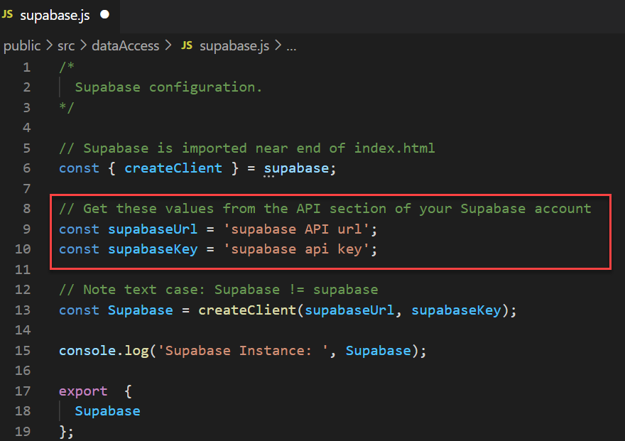


Replace the placeholder values of ```supabaseUrl``` and ```supbaseKey``` with your values which can be found in the API settings section of your Supabase database.

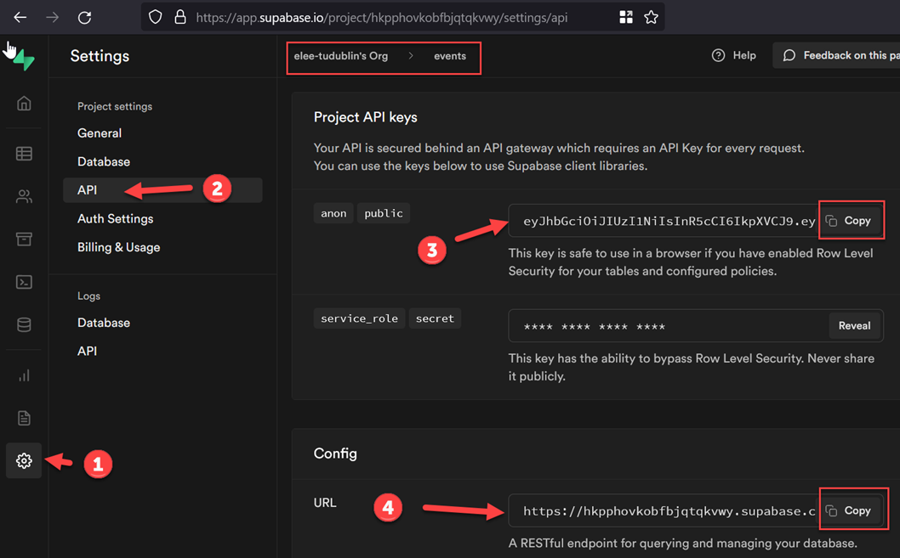

The rest of ```supbase.js``` creates a connection to Supabase, which is exported as ```Supabase```

## Retrieve and Display Data

### index.html

When index.html loads first, it is empty and looks like this: 

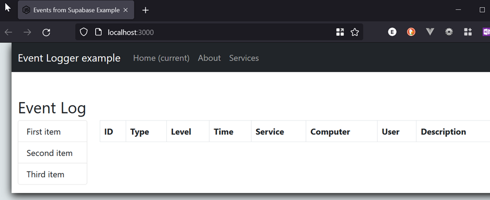


The events will be inserted in index.html as rows in the ```tbody``` element of the events table with ```id="eventRows"```

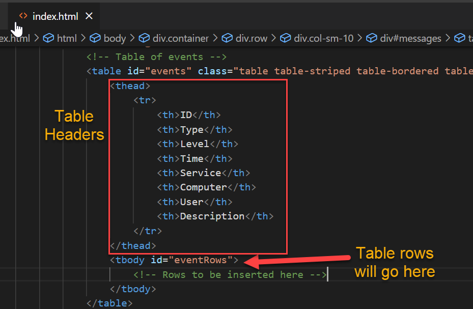


Near the end of ```index.html``` you will see that the script ```./src/index.js``` is loaded. This script is responsible for retrieving and displaying data when the client app is loaded. This section describes the process in detail.

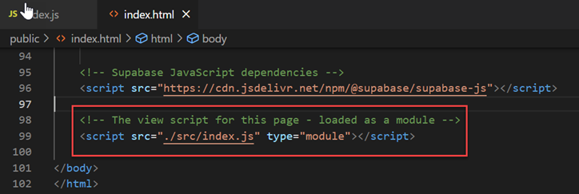


### index.js - reference the html table

The main purpose of this script is to get the data and then add it as content to ```index.html```. No data will be displayed until this script executes.

Line 10 of  ```index.js``` gets a reference to the page element (```index.html``` ) where event details will be inserted. This will be referenced using the ```eventRows``` variable.

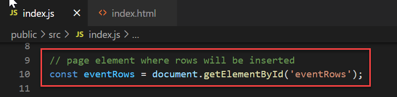


### index.js - retrieving data

 ```index.js```  starts by importing ```./dataAccess/eventdata.js```, which contains the data access functions. 

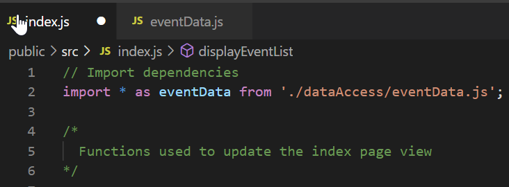


further down the page at line 49, the ```async function loadAndDisplayData()``` calls ```eventData.getAllEvents()``` to get a list of the events from Supabase.


### getAllEvents()

The function is  in **```public/src/dataAccess/eventData.js```**. This file contains all of the functions required for getting event data from Supabase and is imported as ```eventData``` at the start of ```index.js```. 

That is why it is it is called using ```eventData.getAllEvents()```

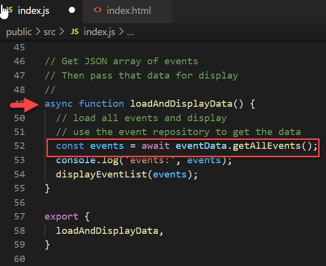

 

Here is the contends of ```eventData.js``` showing ```getAllEvents()```. The function calls the SupaBase API and retrieves all the events. The syntax used is similar to SQL.

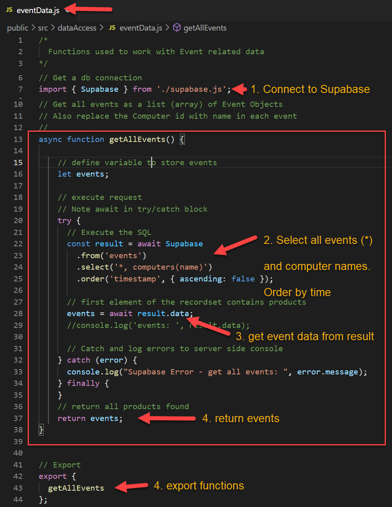


### index.js - Display Events

The list of ```events``` returned by ```getAllEvents()``` is  passed to the ```displayEventList()``` function (in index.js).

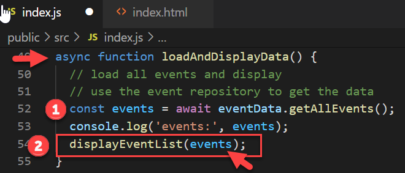


```displayEventList(events)``` can be found near the top of ```index.js``` at line 15. 

The function creates a table row for each event and then adds the rows to the ```eventRows``` element in ```index.html``` - remember that ```eventRows``` references the ```<tbody>``` section of the events table.

```const tableRows = events.map(event => { // return a row });``` can be read as **return** a html table row *for each* ```event``` found in ```events```. 

The return statement builds the row from ```HTML``` and the attribute values for an ```event```. 

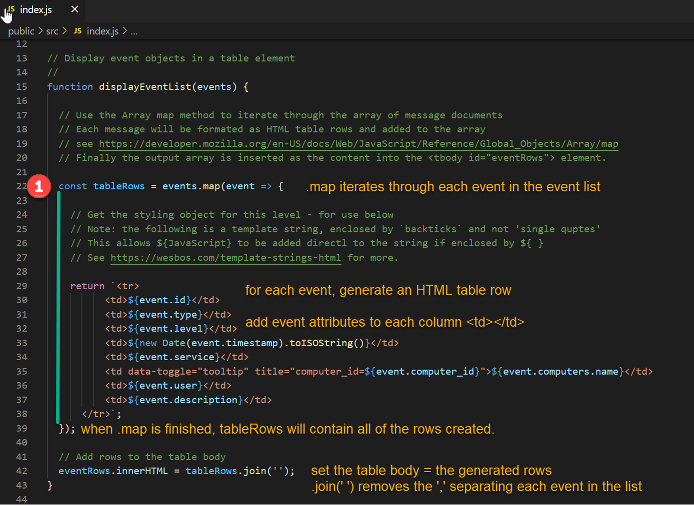

 

## Test the Application

In a web browser, open http://localhost:3000. The page should load and display the data.

Check for details in the browser console where you will say the result of any logging, errors, etc.

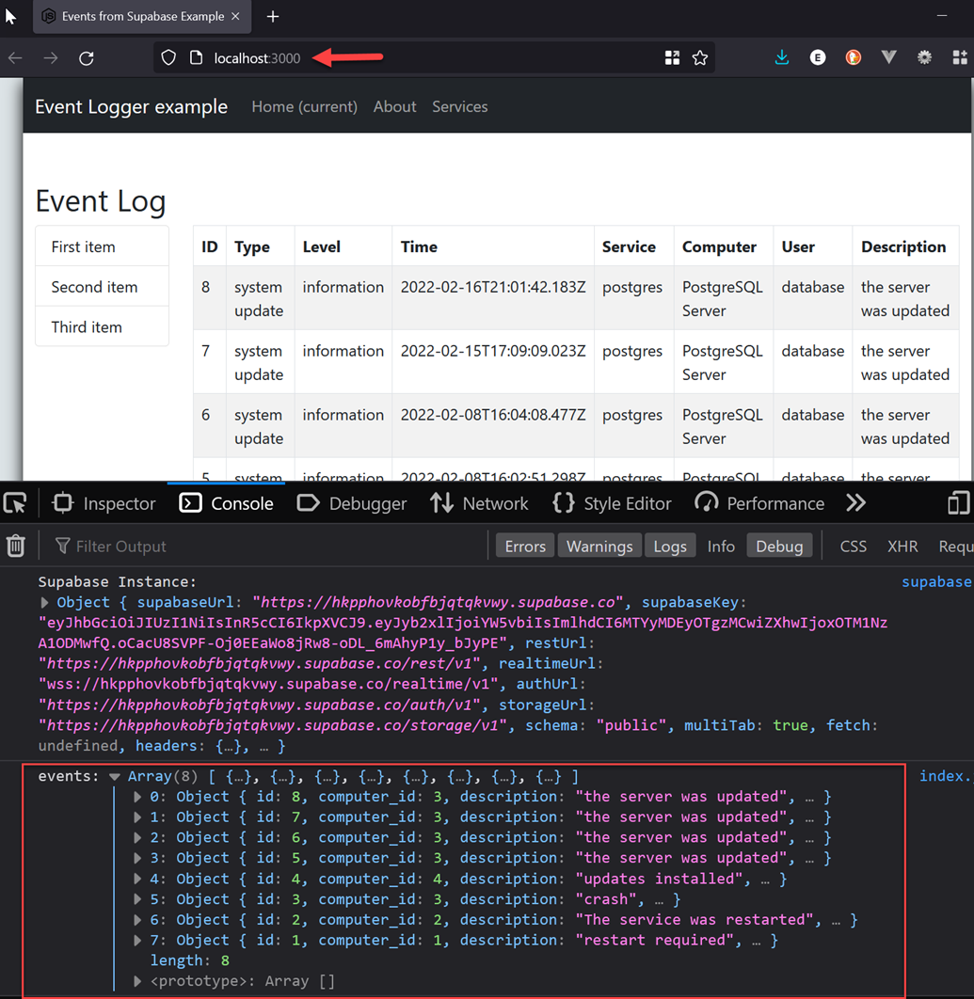


Inspect the event table to see generated rows

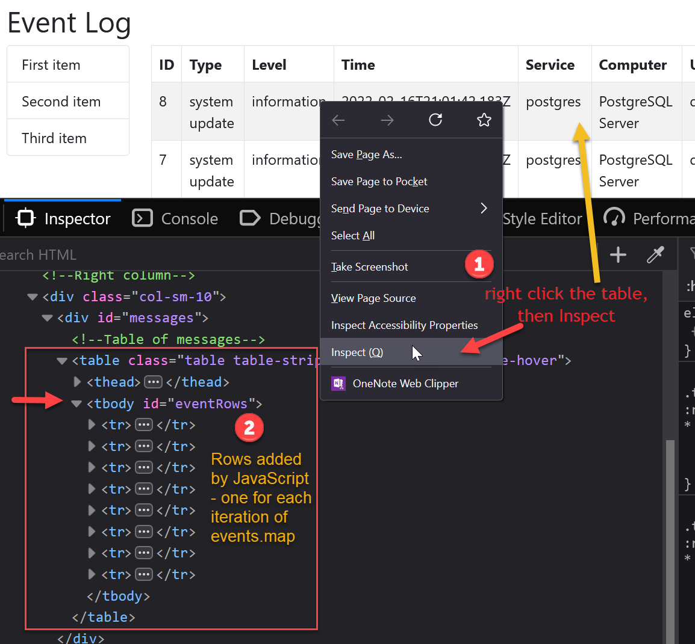


## Exercise

Adapt this example to display data from your project database.


------

**Enda Lee 2022**
